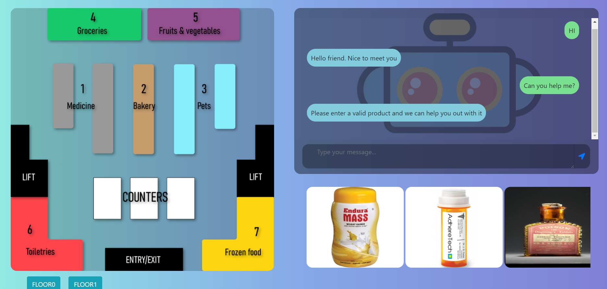
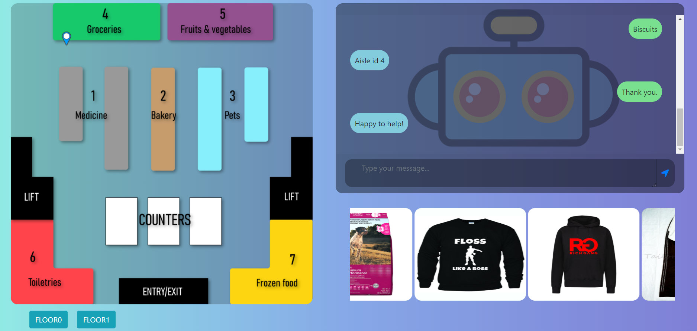

# Retail Store Navigational Chatbot
A Chatbot for aiding users to navigate through aisles and search for the product required in a Retail Store.

# Table of Contents

* [Description](https://github.com/amurto/retail-chatbot#description)
* [Installation](https://github.com/amurto/retail-chatbot#installation)
  * [Prerequisites](https://github.com/amurto/retail-chatbot#prerequisites)
  * [Instructions](https://github.com/amurto/retail-chatbot#instructions)
* [Usage](https://github.com/amurto/retail-chatbot#usage)
* [License](https://github.com/amurto/retail-chatbot#license)

# Description

This a chatbot for a Retail Store wherein the user can specify the name of the product and the bot will respond with the aisle in which the product is found as well mark that aisle on the indoor floor plan of the store. The app also displays promotional information about the retail store. Technologies used include Python-flask for backend connection of chatbot with web, CNN for creating chatbot model, Ajax for sending and accepting requests dynamically(without refreshing the page) between the client and the server and jquery,html5, css and bootstrap for developing the frontend. 
 
### Demo



# Installation

### Prerequisites

Install Python 3.6+ on the system

### Instructions

Clone the repository
```bash
git clone https://github.com/amurto/retail-chatbot.git
```

Install all the dependencies. Set up an environment if possible.
```bash
pip install -r requirements.txt
```

# Usage

Start the server.
```bash
python app.py
```

Open a web browser and go to
```bash
http://localhost:5000
```

# License

[](https://opensource.org/licenses/MIT)

[MIT License Link](https://github.com/amurto/retail-chatbot/blob/master/LICENSE)